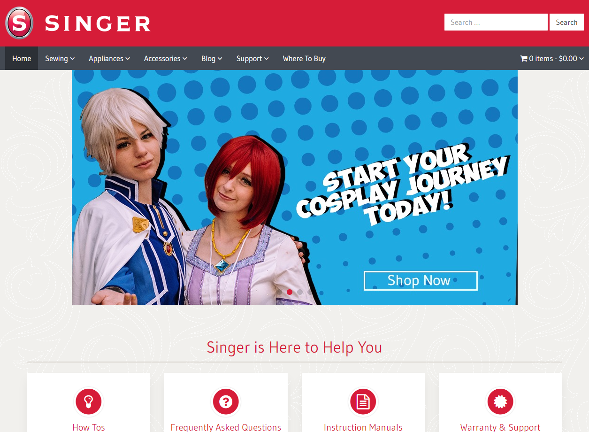
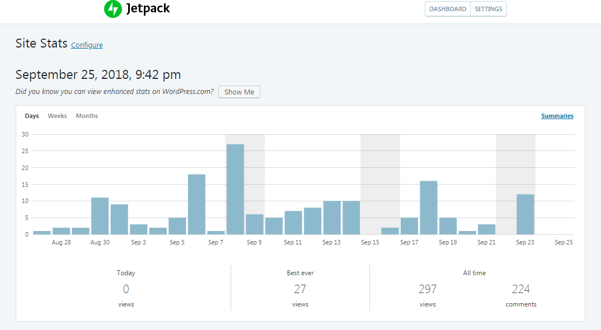

# What You Can Do With WordPress

## Description

In this module you will learn about the many ways WordPress can be used to create blogs, websites, systems, apps, and much more!

## Objectives

After completing this lesson, participants will be able to:

* Identify multiple ways WordPress can be utilized.

## Target Audience

Who is this lesson intended for? What interests/skills would they bring? Choose all that apply.

* [X] Users
* [ ] Designers
* [ ] Developers
* [ ] Speakers
* [ ] All

## Experience Level

How much experience would a participant need to get the most from this lesson?

* [X] Beginner
* [ ] Intermediate
* [ ] Advanced
* [ ] Any

## Type of Instruction

Which strategies will be used for this lesson plan? Choose all that apply.

* [ ] Demonstration
* [ ] Discussion
* [ ] Exercises
* [ ] Feedback
* [X] Lecture (Presentation)
* [ ] Show & Tell
* [ ] Tutorial

## Time Estimate (Duration)

How long will it take to teach this lesson (in minutes)?

30 minutes

## Prerequisite Skills

Participants will get the most from this lesson if they have familiarity with:

* Basic knowledge of blogs and website.
* Basic knowledge of WordPress

## Readiness Questions

*   Are you familiar with [blogs](https://en.wikipedia.org/wiki/Blog)?
*   Are you familiar with [websites](https://en.wikipedia.org/wiki/Website)?

## Materials Needed

*   You will need a computer.
*   You will need access to [WordPress.com](https://wordpress.com/) or a local install of [WordPress download](https://wordpress.org/download/).
* [Slides](../slides/index.html) (included in this repo)

## Notes for the Instructor

* There are no other notes; just links that are highlighted in the text.

## Have You Thought About...?

* What if a participant doesn’t have a WordPress site to work with?

## Lesson Overview

* Talk about various ways WordPress can be used for.
* Practice exercises to have participants to create a blog or a website using WordPress.

## Exercises

**Create a Blog**

Create a blog by selecting the proper tools and using [Lorem Ipsum](http://www.lipsum.com/) to add content.

*   Create a post.
*   Give the post a title.
*   Fill the post with content using Lorem Ipsum.
*   Make several more posts to see how the posts are displayed on the blog page.

**Create a website**

Create a website by selecting the proper tools and using [Lorem Ipsum](http://www.lipsum.com/) to add content.

*   Create a page to set as a homepage.
*   Give the page a title.
*   Fill the page with content using [Lorem Ipsum](http://www.lipsum.com/).
*   Publish the page.
*   Set the homepage to static by going to **Dashboard > Settings > Reading**.
* **Bonus** – add another page to use as a blog page on a website then go to **Dashboard > Settings > Reading** and set that page as a blog page on a website.

## Assessment

**Is it possible to use WordPress to make an app?**

1.  No
2.  Yes, it's great for making games.
3.  Yes, it can take a website and turn that site into an app.

**Correct Answer:** 3\. Yes, it can take a website and turn that site into an app.

**Can my blog become a website?**

1.  Yes.
2.  No, you have to choose to have a blog or a website. You can't do both.

**Correct Answer:** 1\. Yes

## Additional Resources

* [WordPress.com Learn](https://learn.wordpress.com/) - Learn to create blogs and websites using WordPress.com.
* [WPBeginner](https://www.wpbeginner.com/) - Beginner's guide for WordPress

## Example Lesson

### Create a Blog

There are many things we can do with WordPress. For many people, the first thought would be a blog and this is a valid thought. WordPress can be used to create and present dynamic post-based information. Blog posts highlight information about an author, and they are arranged by their date of publication - displaying in reverse chronological order, but that can be changed as well.

A blog is sorted by categories and tags so people can create special pages for their categories and readers can find posts based on tags they are following. Readers can also comment on posts so authors and administrators can establish a two-way dialog with readers.

### Create a Website

Another use for WordPress is to create a website. Unlike the dynamic flow of the blog, a website offers a static page-based presentation of information. Readers view one page at a time (rather than a list of posts), and they access different pages using a navigation menu.

Website pages generally do not offer information on an author, a date of publication, or allow comments. People tend to use websites to generate real-world traffic, making sales and connections in person.

### Create an e-Commerce Website

WordPress can also be used to make sales. It allows for the purchasing of products online. Users can safely and securely process credit card, PayPal, and other payments through Payment Gateways. Site administrators can manage order fulfillment and use tools provided on WordPress to generate sales reports.

### Create a Website with a Blog

It is possible to combine the concepts of blog and website. This is done by making a front page (home page) static then linking to another page, which is set as a blog page. Combining the static page-based information and post-based information combines the best of both approaches.

### Create a Network of Websites

What about having multiple sites, all maintained and monitored by administrators, but set up so users can use their own logins? This is a great WordPress option for educators and businesses, and it can be done using the multisite options. Outside education and business, the multisite can be used for situations such as a pool league, in which each team gets their own site.

### Create a Social Network Website

With self-hosted WordPress sites, it's possible to create a social network site. One can do this using a plugin such as [BuddyPress](https://buddypress.org/) or [bbPress](https://bbpress.org/). On WordPress.com sites, one can use the [P2 theme](https://wordpress.com/themes/p2) to create a forum and by using widgets such as the [talk.io widget](https://en.support.wordpress.com/widgets/tlk-io-widget/) or [Pidgin](https://en.support.wordpress.com/jabber/pidgin/) for chat.

### Create Apps

Turning a self-hosted WordPress site into an app is now possible using the [REST API plugin](https://wordpress.org/plugins/rest-api/). This is handy for events and stores. It allows readers easy-access to a site from their portable devices.

### Monitor Who's Visiting Your Website

WordPress makes it simple to keep track of what is going on with your website. One could use the analytics built-in with [Jetpack](http://jetpack.me/) and a third-party such as [Google Analytics](https://www.google.com/analytics/). It is also simple to integrate third party services via [plugins](https://wordpress.org/plugins/search.php?q=analytics).
WordPress makes it simple to keep track of what is going on with your website. One could use the analytics built-in with [Jetpack](https://jetpack.com/) and a third-party such as [Google Analytics](https://www.google.com/analytics/). It is also simple to integrate third party services via [plugins](https://wordpress.org/plugins/search.php?q=analytics).

### Generate More Web Traffic and Advertising Revenue

People often ask how to make money with their websites. There are various ways to do this with a WordPress site. One way is to use links with [Google AdWords](https://adwords.google.com) and other advertising networks on a self-hosted site. WordPress.com offers [WordAds](https://wordads.co/), which is similar. These options allow a person to place ads on a site and receive compensation for views and clicks. Another income source is [affiliate links](https://en.support.wordpress.com/affiliate-links/). For this, someone signs up with an affiliate program, gets referral links, places them on a site then receives compensation when readers click the link and purchase a product.

### Lesson Wrap Up

 Follow with the Exercises and Assessment outlined above.
